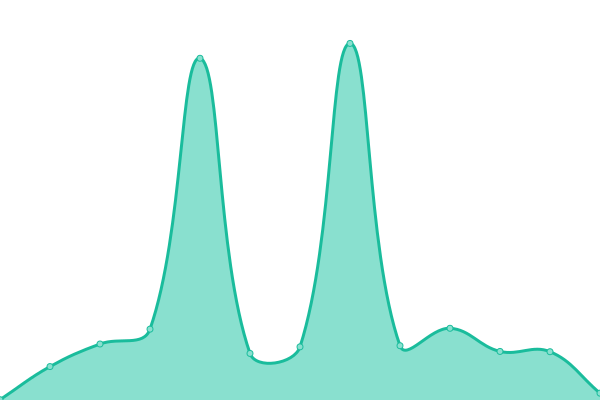

# [📈 Live Status](https://status.azru.cloud): <!--live status--> **🟥 Complete outage**

This repository contains the open-source uptime monitor and status page for [mohrnd](https://status.azru.cloud), powered by [Upptime](https://github.com/upptime/upptime).

With [Upptime](https://upptime.js.org), you can get your own unlimited and free uptime monitor and status page, powered entirely by a GitHub repository. We use [Issues](https://github.com/mohrnd/azru-status/issues) as incident reports, [Actions](https://github.com/mohrnd/azru-status/actions) as uptime monitors, and [Pages](https://status.azru.cloud) for the status page.

<!--start: status pages-->
<!-- This summary is generated by Upptime (https://github.com/upptime/upptime) -->
<!-- Do not edit this manually, your changes will be overwritten -->
<!-- prettier-ignore -->
| URL | Status | History | Response Time | Uptime |
| --- | ------ | ------- | ------------- | ------ |
|  [azru.cloud](https://azru.cloud) | 🟥 Down | [azru-cloud.yml](https://github.com/mohrnd/azru-status/commits/HEAD/history/azru-cloud.yml) | 

 0ms
     
 | 

<a href="https://status.azru.cloud/history/azru-cloud">100.00%</a>
    

|  [pebble.azru.cloud](https://pebble.azru.cloud) | 🟥 Down | [pebble-azru-cloud.yml](https://github.com/mohrnd/azru-status/commits/HEAD/history/pebble-azru-cloud.yml) | 

 0ms
     
 | 

<a href="https://status.azru.cloud/history/pebble-azru-cloud">49.27%</a>
    

|  [API](https://pebble.azru.cloud/api/v1/health/ping) | 🟥 Down | [api.yml](https://github.com/mohrnd/azru-status/commits/HEAD/history/api.yml) | 

 0ms
     
 | 

<a href="https://status.azru.cloud/history/api">48.63%</a>
    

|  [Keystone (Identity)](https://pebble.azru.cloud/api/v1/status/keystone) | 🟥 Down | [keystone-identity.yml](https://github.com/mohrnd/azru-status/commits/HEAD/history/keystone-identity.yml) | 

 0ms
     
 | 

<a href="https://status.azru.cloud/history/keystone-identity">49.26%</a>
    

|  [Nova (Compute)](https://pebble.azru.cloud/api/v1/status/nova) | 🟥 Down | [nova-compute.yml](https://github.com/mohrnd/azru-status/commits/HEAD/history/nova-compute.yml) | 

 0ms
     
 | 

<a href="https://status.azru.cloud/history/nova-compute">49.26%</a>
    

|  [Neutron (Network)](https://pebble.azru.cloud/api/v1/status/neutron) | 🟥 Down | [neutron-network.yml](https://github.com/mohrnd/azru-status/commits/HEAD/history/neutron-network.yml) | 

 0ms
     
 | 

<a href="https://status.azru.cloud/history/neutron-network">49.26%</a>
    

|  [Glance (Images)](https://pebble.azru.cloud/api/v1/status/glance) | 🟥 Down | [glance-images.yml](https://github.com/mohrnd/azru-status/commits/HEAD/history/glance-images.yml) | 

 0ms
     
 | 

<a href="https://status.azru.cloud/history/glance-images">49.26%</a>
    

|  [Cinder (Volumes)](https://pebble.azru.cloud/api/v1/status/cinder) | 🟥 Down | [cinder-volumes.yml](https://github.com/mohrnd/azru-status/commits/HEAD/history/cinder-volumes.yml) | 

 0ms
     
 | 

<a href="https://status.azru.cloud/history/cinder-volumes">49.25%</a>
    

<!--end: status pages-->

[**Visit our status website →**](https://status.azru.cloud)

## 📄 License

- Powered by: [Upptime](https://github.com/upptime/upptime)
- Code: [MIT](./LICENSE) © [Anand Chowdhary](https://anandchowdhary.com), supported by [Pabio](https://pabio.com)
- Data in the `./history` directory: [Open Database License](https://opendatacommons.org/licenses/odbl/1-0/)
